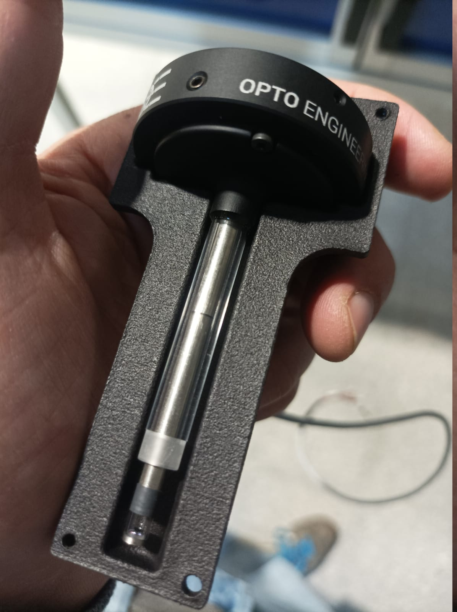
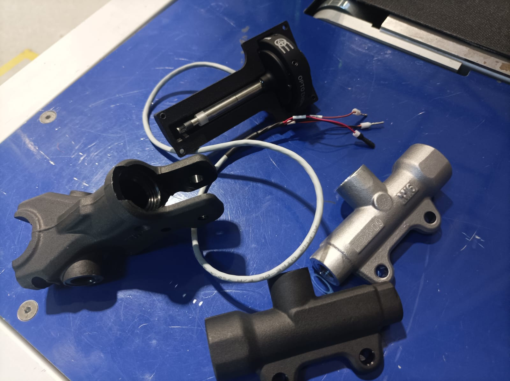
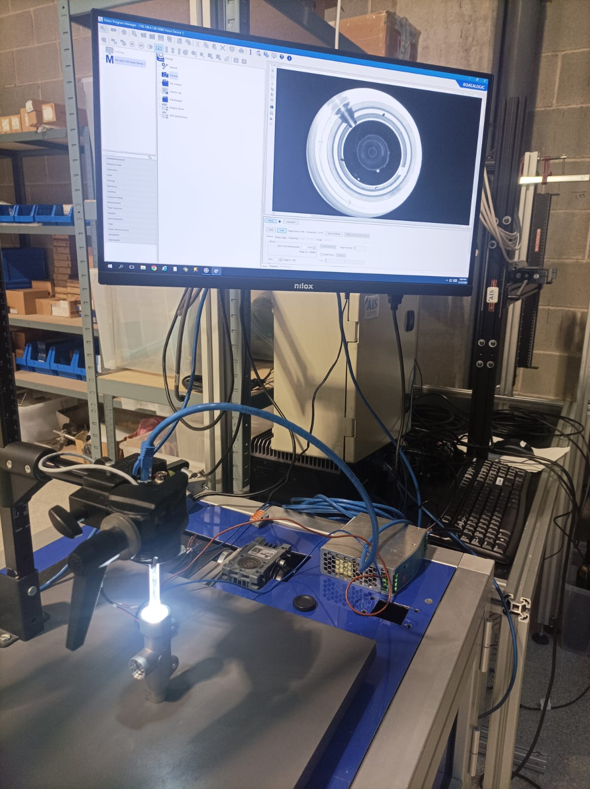
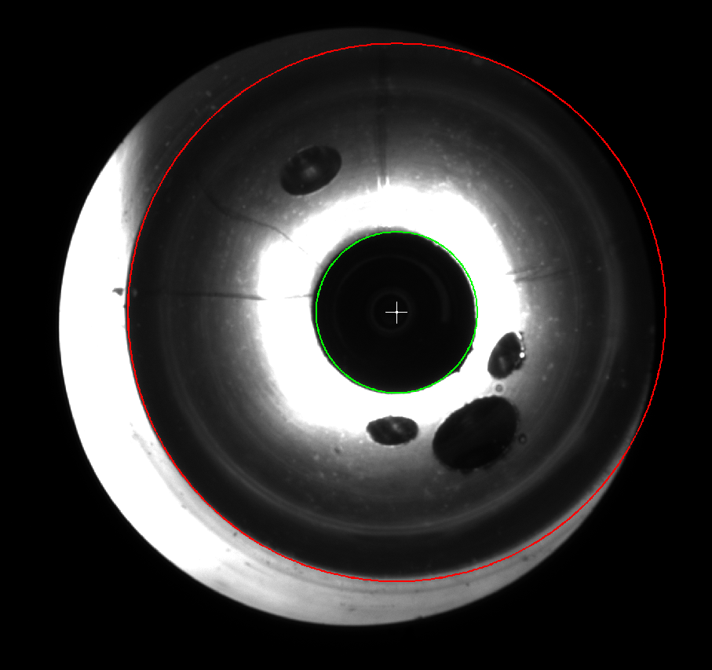
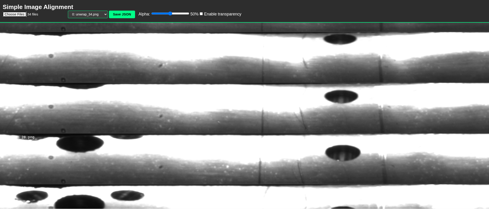

# KTM Brake Cylinder Quality Inspection System

## Project Overview

This project implements an automated quality inspection system for the inner surfaces of brake cylinders using advanced boroscopic imaging and AI-powered defect detection. The system captures, processes, and analyzes 360° panoramic views of cylinder interiors to identify manufacturing defects and anomalies.

---

## Table of Contents

1. [Hardware Setup](#hardware-setup)
2. [Capture Process](#capture-process)
3. [Image Processing Pipeline](#image-processing-pipeline)
   - [Donut Unwrapping](#1-donut-unwrapping)
   - [Vertical Alignment](#2-vertical-alignment)
   - [Image Stitching](#3-image-stitching)
4. [AI-Powered Defect Detection](#ai-powered-defect-detection)
5. [Human Supervision](#human-supervision)
6. [Technical Specifications](#technical-specifications)
7. [Output Format](#output-format)

---

## Hardware Setup

### Boroscopic Lens System

Due to the compact 13mm diameter of the brake cylinders, we utilize a specialized boroscopic lens that can be inserted into the cylinder interior. This lens provides:

- **360° horizontal field of view**
- **60° vertical field of view**
- **Circular "donut" image output**



### Inspection Pieces

The system inspects the inner cylindrical surfaces of brake components, which require high-precision quality control to ensure safety and performance standards.



### Capture Setup

The capture system consists of:
- High-precision vertical slider with **nanometric positioning accuracy**
- Boroscopic camera assembly
- Controlled lighting system
- Automated positioning control



---

## Capture Process

### Multi-Position Scanning

The inspection process captures multiple images along the vertical axis of the cylinder:

1. **Vertical stepping**: Captures are taken approximately every **6mm** along the cylinder height
2. **Overlap strategy**: To avoid distortion from the lens edges, only the central portion of the 60° vertical FOV is used
3. **Image overlap**: Adjacent captures have **20-30% vertical overlap** to ensure complete coverage and seamless stitching

### Raw Capture Example

The boroscopic lens produces circular "donut" shaped images that capture the complete 360° view of the cylinder interior at each vertical position.


---

## Image Processing Pipeline

### 1. Donut Unwrapping

#### Purpose
Convert the circular "donut" images into rectangular panoramic strips for easier analysis and stitching.

#### Calibration UI

We developed custom user interface allows operators to define the inner and outer circles of the donut image. Both circles share the same center point.



#### Calibration Process

1. **Initial calibration**: Performed once per setup
2. **Auto-adjustment**: The system automatically adjusts circle positions and dimensions for each capture to account for real-world tolerances and minor positioning variations
3. **Parameters stored**: Configuration saved in JSON format for reproducibility

#### Output Format

The calibration generates a `params.json` file with the following structure:

```json
{
  "image_path": "/home/jordi/Documents/ais/ktm/captures/E198/metal/26.png",
  "image_width": 2464,
  "image_height": 2056,
  "center": [1337, 969],
  "inner_radius": 148,
  "outer_radius": 500
}
```

**Parameters:**
- `center`: [x, y] coordinates of the donut center
- `inner_radius`: Radius of the inner circle (pixels)
- `outer_radius`: Radius of the outer circle (pixels)

#### Unwrapped Result

The unwrapping process converts each donut image into a rectangular panoramic strip:


#### Full Vertical Sequence

This video shows all unwrapped images in sequence, demonstrating the vertical progression through the cylinder:
<video controls width="600" height="200">
    <source src="captures/E198/metal/unwrapped_video.mp4" type="video/mp4">
    Your browser does not support the video tag.
</video>
---

### 2. Vertical Alignment

#### Purpose
Precisely position each unwrapped strip vertically to account for the physical spacing between captures.

#### Alignment UI

We designed an interactive interface that allows to manually position the unwrapped images with pixel-level precision:



#### Process

1. **Load unwrapped images**: Import all unwrapped strips from a capture session
2. **Manual positioning**: User adjusts vertical offset between adjacent images
3. **Overlap validation**: Ensure proper 20-30% overlap between strips
4. **Generate stitching map**: Export JSON file defining the stitching configuration

#### Output

The alignment UI generates a stitching configuration file that defines:
- Vertical offsets between images
- Overlap regions
- Blending parameters
- Image order and dimensions

---

### 3. Image Stitching

#### Purpose
Combine all vertically-aligned unwrapped strips into a single continuous panoramic view of the entire cylinder interior.

#### Stitching Process

1. **Load alignment configuration**: Use the JSON from the alignment step
2. **Blend overlap regions**: Smooth transitions between adjacent strips using alpha blending
3. **Color correction**: Normalize brightness and color across the entire mosaic
4. **Generate final panorama**: Create complete unwrapped cylinder view

#### Final Result

The stitching process produces a complete, continuous view of the cylinder's inner surface:


---

## AI-Powered Defect Detection

### Trained Detection Model

The system employs a custom-trained AI model specifically designed to identify manufacturing defects and anomalies in brake cylinder surfaces.

#### Model Capabilities

- **Defect localization**: Identifies precise locations of anomalies
- **Bounding box visualization**: Marks detected defects with clear boundaries
- **Defect classification**: Categorizes types of defects (scratches, pits, contamination, etc.)
- **Measurement**: Provides size estimates for detected defects

#### Detection Workflow

1. **Load stitched panorama**: Process the complete cylinder view
2. **Run inference**: Apply trained model to detect anomalies
3. **Generate annotations**: Create bounding boxes and labels for detected defects
4. **Export results**: Produce annotated images and detection reports

#### Example Detection Output


*Example showing detected defects marked with bounding boxes and classification labels*

---

## Human Supervision

### Quality Control Workflow

While the AI model provides automated detection, **final quality decisions require human expertise**:

1. **AI-assisted inspection**: Model highlights potential defects for review
2. **Expert validation**: Human inspector examines each flagged region
3. **False positive filtering**: Inspector dismisses non-critical detections
4. **Final approval**: Quality control expert makes the final accept/reject decision

### Benefits of Hybrid Approach

- **Efficiency**: AI reduces inspection time by highlighting areas of concern
- **Accuracy**: Human expertise ensures critical defects aren't missed
- **Learning**: Inspection feedback can be used to continuously improve the AI model
- **Compliance**: Maintains human accountability for quality decisions

---

## Technical Specifications

### Image Capture
- **Lens type**: Boroscopic 360° panoramic
- **Sensor type**: Datalogic E198 2448 * 2048 px
- **Horizontal FOV**: 360° (complete circumference)
- **Vertical FOV**: 60° (central portion used to minimize distortion)
- **Cylinder diameter**: 13 mm
- **Vertical step size**: ~6 mm
- **Image overlap**: 20-30% between adjacent captures
- **Positioning precision**: Nanometric accuracy

### Image Processing
- **Raw image format**: Circular "donut" shaped
- **Unwrapped format**: Rectangular panoramic strips
- **Processing pipeline**: Unwrap → Align → Stitch → Detect

### AI Model
- **Task**: Defect detection
- **Input**: Stitched panoramic cylinder view
- **Output**: Bounding boxes, classifications, measurements
- **Supervision**: Human-in-the-loop validation

---

## Output Format

### Directory Structure

```
captures/
└── [PIECE_ID]/
      ├── params.json             # Donut unwrapping parameters
      ├── [N].png                 # Raw donut captures
      ├── unwrapped/
      │   └── nwrap_[NN].png      # Unwrapped strips
      ├── alignment_config.json   # Stitching configuration
      ├── unwrapped_blend.png     # Final stitched result
      └── defect_result.png       # AI annotated output
```

### Parameter Files

**params.json**: Donut unwrapping configuration
```json
{
  "image_path": "path/to/capture.png",
  "image_width": 2464,
  "image_height": 2056,
  "center": [x, y],
  "inner_radius": pixels,
  "outer_radius": pixels
}
```

**alignment_config.json**: Vertical alignment and stitching
```json
{
  "images": [
    {
      "filename": "unwrap_01.png",
      "vertical_offset": 0,
      "overlap_top": 0,
      "overlap_bottom": 50
    },
    {
      "filename": "unwrap_02.png",
      "vertical_offset": 180,
      "overlap_top": 50,
      "overlap_bottom": 50
    }
  ],
  "blend_width": 30,
  "total_height": 2500
}
```

---

## Future Improvements

### Planned Enhancements

1. **Automatic circle detection**: Fully automated donut calibration without manual UI

2. **Enhanced auto-alignment**: Computer vision-based vertical alignment without manual positioning

3. **Model improvement**: Continuous training with inspection feedback


---

**Last Updated**: 2025-12-04
